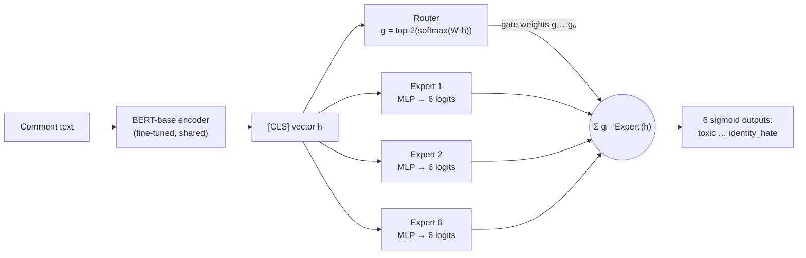

# Toxic Comment Classification with a Mixture-of-Experts BERT

[](https://github.com/qpp112/toxic-comment-moe/actions/workflows/tests.yml)
[](https://colab.research.google.com/github/qpp112/toxic-comment-moe/blob/main/notebooks/train_on_colab.ipynb)


Multi-label toxicity detection on the [Jigsaw Toxic Comment Classification Challenge](https://www.kaggle.com/competitions/jigsaw-toxic-comment-classification-challenge)
(Wikipedia talk-page comments, 6 overlapping labels). A fine-tuned BERT encoder feeds a
**Mixture-of-Experts (MoE) classification head**, trained with a **class-balanced focal loss**
so that the rarest labels (`threat` is 0.3% of comments) are not drowned out.

The repo is a full rewrite of a course project (UC Irvine CS178, Fall 2025). It contains a
controlled **loss × head ablation** on the full dataset with 3 seeds per setting, plus a check
that the result holds on a stronger encoder (DeBERTa-v3), all scored on Kaggle's official
labelled test set. [`docs/course_project.md`](docs/course_project.md) describes the original
project and the bugs this version fixes.

## Results

<!-- RESULTS:START -->
> ⏳ **Full-data runs in progress.** The tables and figures in this section are generated by
> [`scripts/make_report.py`](scripts/make_report.py) from `results/*/metrics.json` and will be
> filled in once the training runs finish. For the original course-project numbers see
> [`docs/course_project.md`](docs/course_project.md).
<!-- RESULTS:END -->

## The problem

Each comment can carry any subset of six labels, and the labels are highly imbalanced
(rates on `train.csv`): `toxic` ≈ 9.6%, `obscene` ≈ 5.3%, `insult` ≈ 4.9%, `severe_toxic` ≈ 1.0%,
`identity_hate` ≈ 0.9%, `threat` ≈ 0.3%. About 90% of comments are clean. That makes two common
habits misleading:

* **Accuracy is meaningless here.** About 96% of all label entries are 0, so a model that
  predicts "clean" everywhere already gets ~96% element-wise accuracy. This repo reports
  ROC-AUC (Kaggle's metric), PR-AUC and F1 instead.
* **Plain BCE ignores the rare labels.** In the course project, BERT + BCE and the first MoE
  scored F1 = 0 on `severe_toxic`, `threat` and `identity_hate`.

## Approach



**Mixture-of-Experts head** ([`models.py`](src/toxic_moe/models.py)). Six expert MLPs each
predict *all six labels*. A learned router sends each comment to its top-2 experts and mixes
their logits with renormalised softmax weights. A Switch-Transformer load-balancing loss
(`aux = E · Σᵢ fᵢ·Pᵢ`, weight 0.01) stops the router from collapsing onto one expert. The
baseline uses the same encoder with a single linear head.

**Class-balanced focal loss** ([`losses.py`](src/toxic_moe/losses.py)). Inverse-frequency
weighting (`#neg/#pos`) gives `threat` a positive weight of about 333, which makes the model
over-predict it. The *effective number of samples* `E(n) = (1−βⁿ)/(1−β)` from
[Cui et al., 2019](https://arxiv.org/abs/1901.05555) grows sub-linearly in `n`. Using it gives
a much softer weight `w_c = E(n⁻_c)/E(n⁺_c)` (about 24 for `threat` and 1.3 for `toxic` at
β = 0.9999). That weight is combined with focal modulation `(1−p_t)^γ`
([Lin et al., 2017](https://arxiv.org/abs/1708.02002)), γ = 2, which down-weights the flood
of easy negatives:

$$\ell_c = -\,w_c\,y\,(1-p)^{\gamma}\log p \;-\; (1-y)\,p^{\gamma}\log(1-p)$$

**Evaluation protocol** ([`experiment.py`](src/toxic_moe/experiment.py)):

| Split | Source | Used for |
|---|---|---|
| train | 90% of `train.csv`, stratified by label combination | gradient updates |
| validation | 10% of `train.csv` | best-epoch selection (ROC-AUC) **and** per-label F1 thresholds |
| test | Kaggle `test.csv` + `test_labels.csv`, unscored (`-1`) rows dropped → 63,978 comments | final numbers only, never used for any choice |

**Ablation** ([`configs/ablation.yaml`](configs/ablation.yaml)): {linear head, MoE head} × {BCE,
weighted BCE, focal, class-balanced focal}, each trained with **3 seeds** (42, 43, 44): 24 runs.
The data split is the same for every run, so seeds only change initialisation, dropout and batch
order. Tables report mean ± std over seeds, and the headline comparison is **paired by seed**:
on this dataset, differences between methods can be as small as seed-to-seed noise, and a single
run per setting cannot separate the two. All runs share the hyper-parameters: 2 epochs, AdamW,
lr 2e-5 for the encoder and 1e-4 for the head, 6% warm-up then linear decay, batch 32, max 128
tokens.

**Stronger encoder** ([`configs/encoders.yaml`](configs/encoders.yaml)): the baseline (linear
head + BCE) and the headline model (MoE head + class-balanced focal) repeated with
DeBERTa-v3-base, 3 seeds each, to check that the gain is not specific to BERT.

Engineering details:

* **Mixed precision:** bf16 on A100/L4, fp16 with loss scaling on older GPUs.
* **Length-grouped batching with dynamic padding.** Most comments are far shorter than 128
  tokens, so this roughly halves the compute.
* **Cached tokenisation.**
* **Resumable runs.** A finished run is skipped, so a Colab disconnect costs at most one run.
  Runs are ordered seed-major, so a partly finished study is still a complete single-seed ablation.
* **Fully deep-copied best checkpoint.**
* **CPU test suite with a tiny randomly initialised BERT,** run on every push by GitHub Actions.

## Reproduce

**Colab (recommended; A100 or L4 GPU).** Open
[`notebooks/train_on_colab.ipynb`](notebooks/train_on_colab.ipynb) with the badge above. It
runs the tests, loads the data (the zip from Kaggle's *Download All* button, uploaded to Google
Drive), trains both studies (results go to Google Drive, so the notebook can resume after a
disconnect), builds the report, and lets you try the model on your own sentences.

**Local / any GPU machine:**

```bash
git clone https://github.com/qpp112/toxic-comment-moe && cd toxic-comment-moe
pip install -e ".[dev,deberta]"
pytest                                   # ~1 min on CPU, no downloads needed
# data: put the Kaggle "Download All" zip in data/ (it is unzipped automatically),
# or use the Kaggle API: bash scripts/download_data.sh data
python scripts/run_ablation.py --list    # show the 24 runs
python scripts/run_ablation.py --only moe_cbfocal --seeds 42 --set train_fraction=0.01 epochs=1 output_dir=results_smoke
python scripts/run_ablation.py                                   # main study -> results/<run>/metrics.json
python scripts/run_ablation.py --config configs/encoders.yaml    # DeBERTa-v3 study
python scripts/make_report.py --update-readme
```

**Use a trained model:**

```bash
python -m toxic_moe.predict --run-dir results/moe_cbfocal_s42 "Thanks for fixing the citation!" "I will find you"
```

The output contains per-label probabilities, the labels that cross the validation-tuned
thresholds, and the router weights over the six experts.

## Repository layout

```
src/toxic_moe/
  data.py         loading, test-label merge, stratified splits
  batching.py     cached tokenisation, dynamic padding, length-grouped batch sampler
  models.py       BERT encoder + linear head / MoE head, load-balancing loss
  losses.py       BCE, weighted BCE, focal, class-balanced focal
  metrics.py      ROC-AUC, PR-AUC, F1 with validation-tuned thresholds, router statistics
  train.py        AMP training loop, warm-up/decay schedule, best-epoch selection
  experiment.py   one end-to-end run -> results/<name>/
  predict.py      inference on raw text
configs/          base settings, main ablation, DeBERTa study, optional MoE design study
scripts/          run_ablation.py, make_report.py, download_data.sh
notebooks/        train_on_colab.ipynb
tests/            CPU test suite (tiny random BERT, synthetic data)
docs/             course-project write-up, figures
```

## Credits

The original course project was a team effort in UC Irvine CS178 (Machine Learning & Data
Mining), Fall 2025, Team 92: **Qui Phu Pham**, **Kat Strekalova** and **Tsunami Tazawa**.
Qui built the BERT models, the weighted-loss and threshold experiments and the first MoE
model. Kat handled data cleaning and the DistilBERT experiments. Tsunami built the Naive Bayes
baseline and the BiLSTM model. This repository (v2) is Qui's rewrite and extension of the
BERT/MoE part. It is new code, trained on the full dataset.

## References

* Devlin et al. *BERT: Pre-training of Deep Bidirectional Transformers for Language Understanding.* NAACL 2019.
* Lin et al. *Focal Loss for Dense Object Detection.* ICCV 2017.
* Cui et al. *Class-Balanced Loss Based on Effective Number of Samples.* CVPR 2019.
* Shazeer et al. *Outrageously Large Neural Networks: The Sparsely-Gated Mixture-of-Experts Layer.* ICLR 2017.
* Fedus, Zoph & Shazeer. *Switch Transformers.* JMLR 2022.
* Jigsaw / Conversation AI. *Toxic Comment Classification Challenge.* Kaggle, 2018.

## License

Code: MIT (see [LICENSE](LICENSE)). The Jigsaw data is **not** included. Download it from
Kaggle under the competition's terms. The data contains offensive language.
