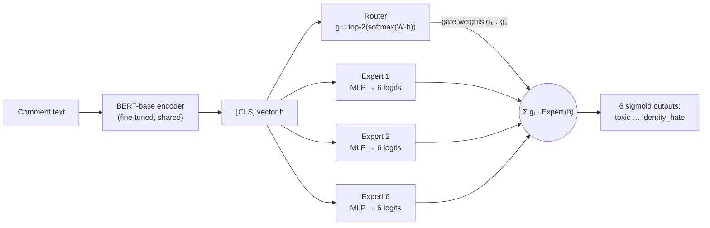

# Toxic comment classification: do a Mixture-of-Experts head and class-balanced losses help?

[](https://github.com/qpp112/toxic-comment-moe/actions/workflows/tests.yml)
[](https://colab.research.google.com/github/qpp112/toxic-comment-moe/blob/main/notebooks/train_on_colab.ipynb)


Multi-label toxicity detection on the [Jigsaw Toxic Comment Classification Challenge](https://www.kaggle.com/competitions/jigsaw-toxic-comment-classification-challenge)
(Wikipedia talk-page comments, 6 overlapping labels; `threat` is 0.3% of comments). In a course
project (UC Irvine CS178, Fall 2025), reweighted losses seemed to help BERT with the rare labels
and a Mixture-of-Experts (MoE) head looked promising. This repository rebuilds that project
properly and tests both ideas in a controlled study: **2 classification heads × 4 losses × 3 seeds
= 24 BERT-base runs** on the full training set (160k comments), scored on Kaggle's official
labelled test set (64k comments), with decision thresholds tuned on a validation split only.

**Result: neither the MoE head nor the imbalance-aware losses beat plain BERT + BCE.**

* **All 8 settings tie on ranking quality.** Test ROC-AUC spans 0.9850–0.9858 (baseline
  0.9855 ± 0.0001). Plain BCE has the best PR-AUC; every alternative is 0.005–0.024 lower. On
  macro-F1 and rare-label F1, no gain is distinguishable from seed noise: the largest, +0.017 ±
  0.015 rare-label F1 for MoE + weighted BCE, is about one standard deviation.
* **Reweighting mostly moves the decision threshold.** Weighted BCE pushes the best thresholds to
  0.89–0.998 (plain BCE: 0.18–0.70). At a fixed 0.5 threshold it is far worse than BCE (macro-F1
  0.50 vs 0.62); with thresholds tuned on validation the two tie (0.622 vs 0.617). The course
  project's gain, measured at 0.5 on 1/20 of the data (where plain BCE scored F1 = 0 on the three
  rarest labels), does not survive the full data and tuned thresholds.
* **The MoE router learns toxic vs. clean, not kinds of toxicity.** In all 12 MoE runs, comments
  with any toxic label send on average 90% of their routing weight to the same two of six experts,
  whatever the label; clean comments spread across all six.

[`docs/course_project.md`](docs/course_project.md) describes the original project and the bugs
this version fixes.

## Results

<!-- RESULTS:START -->
Trained on 143,613 comments (100% of `train.csv` minus a 15,958-comment validation split) and evaluated on the **63,978-comment official Kaggle test set**. F1 thresholds are tuned per label on the validation split, never on test. Every setting is trained with 3 seeds (42, 43, 44) on the same data split; cells show mean ± sample std over seeds. Best mean per column in bold; the paired table shows which differences are larger than seed-to-seed noise.

**Difference from the baseline (BERT + linear head + BCE), paired by seed.** Positive = better than the baseline. Mean ± std over 3 seeds.

| Head | Loss | Δ ROC-AUC | Δ PR-AUC | Δ Macro-F1 (val-tuned thr.) | Δ Rare-label F1 |
|---|---|---:|---:|---:|---:|
| Linear head | Weighted BCE | -0.0004 ± 0.0003 | -0.022 ± 0.005 | +0.005 ± 0.012 | +0.013 ± 0.022 |
| Linear head | Focal | +0.0003 ± 0.0001 | -0.005 ± 0.002 | -0.003 ± 0.016 | -0.003 ± 0.023 |
| Linear head | Class-balanced focal | +0.0001 ± 0.0002 | -0.012 ± 0.002 | -0.001 ± 0.018 | +0.001 ± 0.026 |
| MoE head | BCE | +0.0000 ± 0.0001 | -0.008 ± 0.001 | +0.002 ± 0.013 | +0.001 ± 0.014 |
| MoE head | Weighted BCE | -0.0002 ± 0.0001 | -0.024 ± 0.004 | +0.007 ± 0.012 | +0.017 ± 0.015 |
| MoE head | Focal | +0.0002 ± 0.0000 | -0.009 ± 0.002 | +0.001 ± 0.011 | +0.000 ± 0.013 |
| MoE head | Class-balanced focal | +0.0000 ± 0.0002 | -0.010 ± 0.006 | +0.003 ± 0.013 | +0.007 ± 0.012 |

**Routing.** Across all 12 MoE runs, comments carrying any toxic label put on average 90% (minimum 61%) of their router weight on the same two experts, whatever the kind of toxicity, while clean comments put 29% on those two experts (uniform routing would be 33%). The router learned a toxic-vs-clean split, not experts for specific kinds of toxicity.

**Loss × head ablation (BERT-base encoder)**

| Head | Loss | Test ROC-AUC | Test PR-AUC | Macro-F1 @0.5 | Macro-F1 (val-tuned thr.) | Rare-label F1¹ |
|---|---|---:|---:|---:|---:|---:|
| Linear head | BCE | 0.9855 ± 0.0001 | **0.688 ± 0.004** | 0.618 ± 0.001 | 0.617 ± 0.009 | 0.533 ± 0.012 |
| Linear head | Weighted BCE | 0.9850 ± 0.0003 | 0.665 ± 0.008 | 0.502 ± 0.003 | 0.622 ± 0.003 | 0.546 ± 0.010 |
| Linear head | Focal | **0.9858 ± 0.0001** | 0.683 ± 0.006 | 0.618 ± 0.002 | 0.613 ± 0.007 | 0.530 ± 0.012 |
| Linear head | Class-balanced focal | 0.9856 ± 0.0001 | 0.675 ± 0.006 | 0.543 ± 0.005 | 0.615 ± 0.010 | 0.534 ± 0.016 |
| MoE head | BCE | 0.9855 ± 0.0002 | 0.680 ± 0.003 | 0.619 ± 0.002 | 0.619 ± 0.005 | 0.534 ± 0.002 |
| MoE head | Weighted BCE | 0.9853 ± 0.0002 | 0.664 ± 0.005 | 0.507 ± 0.004 | **0.624 ± 0.004** | **0.550 ± 0.006** |
| MoE head | Focal | 0.9857 ± 0.0001 | 0.679 ± 0.004 | **0.619 ± 0.002** | 0.618 ± 0.005 | 0.533 ± 0.004 |
| MoE head | Class-balanced focal | 0.9855 ± 0.0001 | 0.677 ± 0.004 | 0.548 ± 0.001 | 0.620 ± 0.004 | 0.540 ± 0.007 |

¹ Mean test F1 over the three rarest labels: `severe_toxic`, `threat`, `identity_hate`.

**Per label (mean over seeds)**

| Label | Test positives | bert_bce PR-AUC | moe_cbfocal PR-AUC | bert_bce F1 | moe_cbfocal F1 |
|---|---:|---:|---:|---:|---:|
| `toxic` | 6,090 | 0.814 ± 0.001 | 0.814 ± 0.003 | 0.692 ± 0.011 | 0.686 ± 0.020 |
| `severe_toxic` | 367 | 0.394 ± 0.004 | 0.354 ± 0.020 | 0.420 ± 0.003 | 0.401 ± 0.012 |
| `obscene` | 3,691 | 0.807 ± 0.002 | 0.801 ± 0.002 | 0.704 ± 0.005 | 0.709 ± 0.015 |
| `threat` | 211 | 0.623 ± 0.023 | 0.613 ± 0.002 | 0.572 ± 0.015 | 0.593 ± 0.012 |
| `insult` | 3,427 | 0.795 ± 0.002 | 0.794 ± 0.001 | 0.705 ± 0.011 | 0.705 ± 0.001 |
| `identity_hate` | 712 | 0.693 ± 0.001 | 0.689 ± 0.012 | 0.606 ± 0.027 | 0.626 ± 0.014 |

<picture>
  <source media="(prefers-color-scheme: dark)" srcset="docs/figures/ablation_dark.png">
  
</picture>

<picture>
  <source media="(prefers-color-scheme: dark)" srcset="docs/figures/per_label_f1_dark.png">
  
</picture>

<picture>
  <source media="(prefers-color-scheme: dark)" srcset="docs/figures/pr_curves_dark.png">
  
</picture>

<picture>
  <source media="(prefers-color-scheme: dark)" srcset="docs/figures/expert_routing_dark.png">
  
</picture>

<details><summary>Run details</summary>

| Setting | Seeds | Best epoch per seed | Min / run | Precision | GPU |
|---|---|---|---:|---|---|
| `bert_bce` | 42, 43, 44 | 2, 2, 2 | 7.5 | bf16 | NVIDIA A100-SXM4-80GB |
| `bert_wbce` | 42, 43, 44 | 2, 2, 2 | 7.3 | bf16 | NVIDIA A100-SXM4-80GB |
| `bert_focal` | 42, 43, 44 | 2, 2, 2 | 7.4 | bf16 | NVIDIA A100-SXM4-80GB |
| `bert_cbfocal` | 42, 43, 44 | 2, 2, 2 | 7.4 | bf16 | NVIDIA A100-SXM4-80GB |
| `moe_bce` | 42, 43, 44 | 2, 2, 2 | 8.2 | bf16 | NVIDIA A100-SXM4-80GB |
| `moe_wbce` | 42, 43, 44 | 2, 2, 2 | 8.2 | bf16 | NVIDIA A100-SXM4-80GB |
| `moe_focal` | 42, 43, 44 | 2, 2, 2 | 8.2 | bf16 | NVIDIA A100-SXM4-80GB |
| `moe_cbfocal` | 42, 43, 44 | 2, 2, 2 | 8.2 | bf16 | NVIDIA A100-SXM4-80GB |

</details>
<!-- RESULTS:END -->

## Why it didn't help, and what I'd try next

* **Tuned thresholds absorb what reweighting does.** Up-weighting positives shifts every score
  upwards, which mainly changes where the 0.5 cut falls. Once each label gets its own threshold
  from validation data, there is little left for the loss to fix, and ranking quality (PR-AUC)
  gets slightly worse, most of all with inverse-frequency weights.
* **The router split comments, not labels.** It sees one [CLS] vector per comment and learned to
  separate toxic from clean comments. One possible reason (not tested
  here) is that the rare labels mostly co-occur with `toxic`, so a per-comment router has little
  incentive to separate them. Routing per label, or per token, would be the next thing to try.
* **Next steps:** a stronger encoder ([`configs/encoders.yaml`](configs/encoders.yaml):
  DeBERTa-v3-base, set up but not yet run); longer inputs than 128 tokens; per-label routing.

## The problem

Each comment can carry any subset of six labels, and the labels are highly imbalanced
(rates on `train.csv`): `toxic` ≈ 9.6%, `obscene` ≈ 5.3%, `insult` ≈ 4.9%, `severe_toxic` ≈ 1.0%,
`identity_hate` ≈ 0.9%, `threat` ≈ 0.3%. About 90% of comments are clean. That makes two common
habits misleading:

* **Accuracy is meaningless here.** About 96% of all label entries are 0, so a model that
  predicts "clean" everywhere already gets ~96% element-wise accuracy. This repo reports
  ROC-AUC (Kaggle's metric), PR-AUC and F1 instead.
* **The rare labels look hopeless at a fixed 0.5 threshold.** In the course project (1/20 of
  the data), BERT + BCE scored F1 = 0 on `severe_toxic`, `threat` and `identity_hate` at 0.5.
  That motivated the reweighted losses and the MoE head tested here.

## Approach



**Mixture-of-Experts head** ([`models.py`](src/toxic_moe/models.py)). Six expert MLPs each
predict *all six labels*. A learned router sends each comment to its top-2 experts and mixes
their logits with renormalised softmax weights. A Switch-Transformer load-balancing loss
(`aux = E · Σᵢ fᵢ·Pᵢ`, weight 0.01) stops the router from collapsing onto one expert. The
baseline uses the same encoder with a single linear head.

**Class-balanced focal loss** ([`losses.py`](src/toxic_moe/losses.py)). Inverse-frequency
weighting (`#neg/#pos`) gives `threat` a positive weight of about 333, which makes the model
over-predict it. The *effective number of samples* `E(n) = (1−βⁿ)/(1−β)` from
[Cui et al., 2019](https://arxiv.org/abs/1901.05555) grows sub-linearly in `n`. Using it gives
a much softer weight `w_c = E(n⁻_c)/E(n⁺_c)` (about 24 for `threat` and 1.3 for `toxic` at
β = 0.9999). That weight is combined with focal modulation `(1−p_t)^γ`
([Lin et al., 2017](https://arxiv.org/abs/1708.02002)), γ = 2, which down-weights the flood
of easy negatives:

$$\ell_c = -\,w_c\,y\,(1-p)^{\gamma}\log p \;-\; (1-y)\,p^{\gamma}\log(1-p)$$

**Evaluation protocol** ([`experiment.py`](src/toxic_moe/experiment.py)):

| Split | Source | Used for |
|---|---|---|
| train | 90% of `train.csv`, stratified by label combination | gradient updates |
| validation | 10% of `train.csv` | best-epoch selection (ROC-AUC) **and** per-label F1 thresholds |
| test | Kaggle `test.csv` + `test_labels.csv`, unscored (`-1`) rows dropped → 63,978 comments | final numbers only, never used for any choice |

**Ablation** ([`configs/ablation.yaml`](configs/ablation.yaml)): {linear head, MoE head} × {BCE,
weighted BCE, focal, class-balanced focal}, each trained with **3 seeds** (42, 43, 44): 24 runs.
The data split is the same for every run, so seeds only change initialisation, dropout and batch
order. Tables report mean ± std over seeds, and the headline comparison is **paired by seed**:
on this dataset, differences between methods can be as small as seed-to-seed noise, and a single
run per setting cannot separate the two. All runs share the hyper-parameters: 2 epochs, AdamW,
lr 2e-5 for the encoder and 1e-4 for the head, 6% warm-up then linear decay, batch 32, max 128
tokens.

Engineering details:

* **Mixed precision:** bf16 on A100/L4, fp16 with loss scaling on older GPUs. DeBERTa-v3 runs
  in full precision (TF32 matmuls), because it produced NaN losses under bf16.
* **NaN guard:** a NaN/inf loss or gradient is never applied, and a run that keeps producing
  them stops after 20 bad steps instead of silently training on garbage.
* **Length-grouped batching with dynamic padding.** Most comments are far shorter than 128
  tokens, so this roughly halves the compute.
* **Cached tokenisation.**
* **Resumable runs.** A finished run is skipped, so a Colab disconnect costs at most one run.
  Runs are ordered seed-major, so a partly finished study is still a complete single-seed ablation.
* **Fully deep-copied best checkpoint.**
* **CPU test suite with a tiny randomly initialised BERT,** run on every push by GitHub Actions.

## Reproduce

**Colab (recommended; A100 or L4 GPU).** Open
[`notebooks/train_on_colab.ipynb`](notebooks/train_on_colab.ipynb) with the badge above. It
runs the tests, loads the data (the zip from Kaggle's *Download All* button, uploaded to Google
Drive), trains the ablation (results go to Google Drive, so the notebook can resume after a
disconnect), builds the report, and lets you try the model on your own sentences. The 24 runs
took about 8 minutes each on an A100 (bf16).

**Local / any GPU machine:**

```bash
git clone https://github.com/qpp112/toxic-comment-moe && cd toxic-comment-moe
pip install -e ".[dev,deberta]"
pytest                                   # ~1 min on CPU, no downloads needed
# data: put the Kaggle "Download All" zip in data/ (it is unzipped automatically),
# or use the Kaggle API: bash scripts/download_data.sh data
python scripts/run_ablation.py --list    # show the 24 runs
python scripts/run_ablation.py --only moe_cbfocal --seeds 42 --set train_fraction=0.01 epochs=1 output_dir=results_smoke
python scripts/run_ablation.py                                   # main study -> results/<run>/metrics.json
python scripts/run_ablation.py --config configs/encoders.yaml    # optional DeBERTa-v3 study
python scripts/make_report.py --update-readme
```

**Use a trained model:**

```bash
python -m toxic_moe.predict --run-dir results/moe_cbfocal_s42 "Thanks for fixing the citation!" "I will find you"
```

The output contains per-label probabilities, the labels that cross the validation-tuned
thresholds, and the router weights over the six experts.

## Repository layout

```
src/toxic_moe/
  data.py         loading, test-label merge, stratified splits
  batching.py     cached tokenisation, dynamic padding, length-grouped batch sampler
  models.py       BERT encoder + linear head / MoE head, load-balancing loss
  losses.py       BCE, weighted BCE, focal, class-balanced focal
  metrics.py      ROC-AUC, PR-AUC, F1 with validation-tuned thresholds, router statistics
  train.py        AMP training loop, warm-up/decay schedule, best-epoch selection
  experiment.py   one end-to-end run -> results/<name>/
  predict.py      inference on raw text
configs/          base settings, main ablation, DeBERTa study, optional MoE design study
scripts/          run_ablation.py, make_report.py, download_data.sh
notebooks/        train_on_colab.ipynb
tests/            CPU test suite (tiny random BERT, synthetic data)
docs/             course-project write-up, figures
```

## Credits

The original course project was a team effort in UC Irvine CS178 (Machine Learning & Data
Mining), Fall 2025, Team 92: **Qui Phu Pham**, **Kat Strekalova** and **Tsunami Tazawa**.
Qui built the BERT models, the weighted-loss and threshold experiments and the first MoE
model. Kat handled data cleaning and the DistilBERT experiments. Tsunami built the Naive Bayes
baseline and the BiLSTM model. This repository (v2) is Qui's rewrite and extension of the
BERT/MoE part. It is new code, trained on the full dataset.

## References

* Devlin et al. *BERT: Pre-training of Deep Bidirectional Transformers for Language Understanding.* NAACL 2019.
* Lin et al. *Focal Loss for Dense Object Detection.* ICCV 2017.
* Cui et al. *Class-Balanced Loss Based on Effective Number of Samples.* CVPR 2019.
* Shazeer et al. *Outrageously Large Neural Networks: The Sparsely-Gated Mixture-of-Experts Layer.* ICLR 2017.
* Fedus, Zoph & Shazeer. *Switch Transformers.* JMLR 2022.
* Jigsaw / Conversation AI. *Toxic Comment Classification Challenge.* Kaggle, 2018.

## License

Code: MIT (see [LICENSE](LICENSE)). The Jigsaw data is **not** included. Download it from
Kaggle under the competition's terms. The data contains offensive language.
