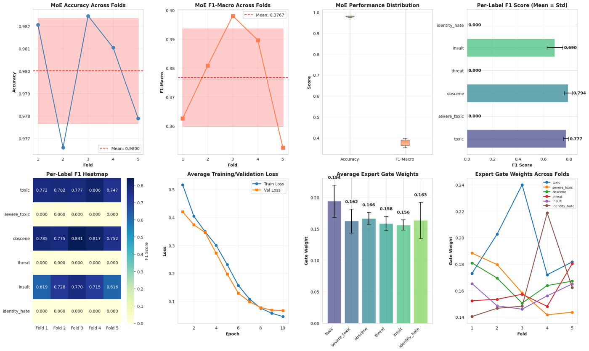
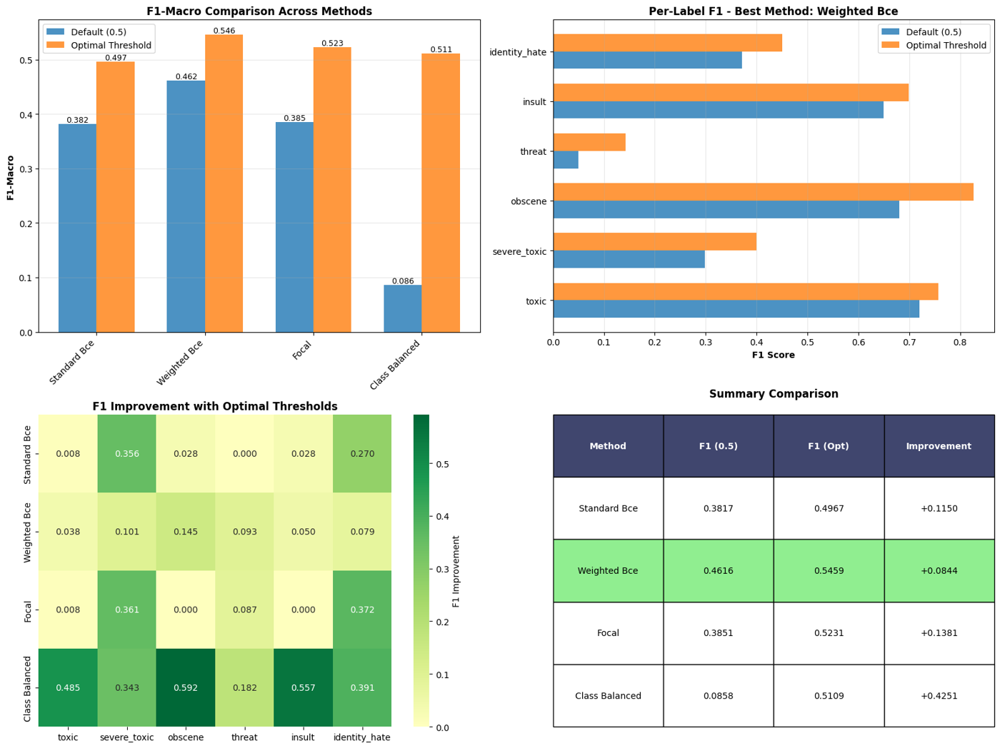

# The original course project, and what v2 changes

This repository grew out of a team project for **UC Irvine CS178 (Machine Learning & Data
Mining), Fall 2025**, Team 92: Qui Phu Pham, Kat Strekalova, Tsunami Tazawa. The team compared
a Naive Bayes baseline, a BiLSTM, DistilBERT, BERT and a first Mixture-of-Experts model, all
trained on a 1/20 random sample of `train.csv` (7,979 comments).

This page records what that version found, what was wrong with it, and how v2 fixes each
problem. Reviewing your own earlier work critically is part of the point.

**Outcome.** With these problems fixed and the full dataset, the course project's main conclusion
did not hold up: weighted losses and the MoE head do not beat plain BERT + BCE once thresholds are
tuned on validation data. See the [README](../README.md) for the 24-run study.

## What the course version found

All numbers below were traced back to the original notebook outputs. They are macro-F1 unless
noted, on a 20% validation split of the 1/20 sample.

| Model (course version) | Setting | Macro-F1 @0.5 | Macro-F1, "optimal" thresholds² |
|---|---|---:|---:|
| Naive Bayes, TF-IDF (baseline) | 80/20 split | 0.085 | 0.140 (threshold 0.3) |
| BERT + BCE | 80/20 split, 2 epochs | 0.382 | 0.497 |
| BERT + focal loss¹ | 80/20 split, 2 epochs | 0.385 | 0.523 |
| BERT + "class-balanced" weighted BCE | 80/20 split, 2 epochs | 0.086 | 0.511 |
| BERT + weighted BCE | 80/20 split, 2 epochs | 0.462 | 0.546 |
| BERT + weighted BCE | 5-fold CV, 2 epochs | 0.431 ± 0.021 | 0.488 ± 0.017 |
| MoE, label-specific experts, BCE | 5-fold CV, 10 epochs | 0.377 ± 0.017 | – |

¹ `alpha=0.25` was applied as a constant multiplier to every term, not as α-balancing.
² Thresholds were tuned on the **same** fold they were scored on, so this column is optimistic.

The first MoE reached ~98% element-wise accuracy but **F1 = 0 on `severe_toxic`, `threat` and
`identity_hate` in all five folds**:

## Problems found on review, and the v2 fix for each

| # | Problem in the course code | Effect | v2 fix |
|---|---|---|---|
| 1 | Best model saved with `model.state_dict().copy()`, a **shallow** copy whose tensors keep training | "Restore best epoch" was a no-op. One log says *"Loaded best model from epoch 1"* while the final metrics equal epoch 3's. | Deep copy to CPU (`train.py`) |
| 2 | Per-label thresholds tuned on the validation fold and scored on that same fold | The "optimal threshold" F1 is inflated | Thresholds tuned on validation, applied unchanged to a separate test set |
| 3 | No held-out test set; the official Kaggle test labels were cleaned but never used | No unbiased final number | Evaluate on the 63,978 labelled Kaggle test comments |
| 4 | MoE notebook read the CSV with `engine="python", on_bad_lines="warn"` | Lines were skipped and the 1/20 sample had 8,219 rows instead of 7,979, so MoE and BERT used different data | Default C parser that fails loudly; one shared loader |
| 5 | MoE "gate" = softmax **across the 6 labels**, multiplied into each label's own expert logit | The independent labels compete for one unit of mass and every logit shrinks ~6×. It is not a mixture of experts. | Each expert predicts all labels; router mixes experts (top-2) with load balancing |
| 6 | MoE trained with plain BCE | Rare labels never predicted | Class-balanced focal loss, plus a full loss × architecture ablation |
| 7 | Element-wise accuracy as the headline metric, and one slide's table mixed weighted-F1 (0.663) with macro-F1 | Misleading comparisons | ROC-AUC (Kaggle metric), PR-AUC, macro-F1 only |
| 8 | MoE trained for 10 epochs at batch size 16, the BERT runs for 2–3 epochs at batch size 32 | MoE vs BERT was not a like-for-like comparison | Identical budget, data split and seed for every run |
| 9 | 1/20 of the data → ~18 `threat` comments in total | Rare-label scores are noise | Full training set (≈430 `threat` comments in the training split) |

## Team contributions (course version)

* **Qui Phu Pham**: BERT fine-tuning, cross-validation, weighted BCE and threshold
  experiments, the first MoE model.
* **Kat Strekalova**: data exploration and test-label cleaning, DistilBERT experiments.
* **Tsunami Tazawa**: Naive Bayes baseline, BiLSTM model.

The v2 code in this repository is a rewrite by Qui and does not include teammates' code.
