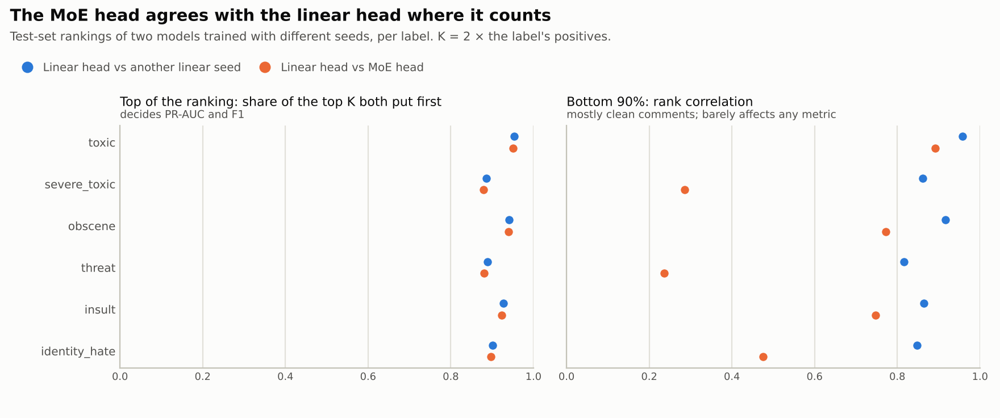

# Why the MoE head didn't help

The 24-run study ([README](../README.md#results)) found that a Mixture-of-Experts head on BERT
ties with a plain linear head. This page works out why, using only the saved runs
(`metrics.json` and the test-set predictions; no extra training). It then sets up the follow-up
experiments that test the explanation, including two heads built to get around it.

Every number here comes from [`scripts/diagnose.py`](../scripts/diagnose.py). Its full output
is in [`results/diagnosis.md`](../results/diagnosis.md). Unless a section says otherwise, it
compares `bert_bce` (linear head) with `moe_bce` (MoE head): same loss, same seeds, same data.

## The short answer

1. **The router learned to separate toxic from clean comments, which the linear head already
   does.** In all 12 MoE runs, the positive comments of all six labels go mostly to the same
   two experts. The labels never got experts of their own.
2. **Where the metrics are decided, the MoE head ranks comments the same way the linear head
   does.** At the top of each label's ranking, it agrees with the linear head as closely as a
   second linear-head seed does. The two heads differ only in how they order the clean bulk,
   which no metric looks at.
3. **The small F1 differences in the results table are mostly threshold noise.** With the
   noise from validation-tuned thresholds removed, the seed-to-seed spread of the macro-F1
   differences shrinks about 4× (2–8×), and no MoE head is better than the baseline.

The underlying reason: **one router decision per comment cannot separate labels that almost
always occur together.** Most comments with a rare label are also `toxic`. On top of that, a
fine-tuned BERT can make its [CLS] vector good enough for a linear layer, which leaves the
extra 1.2M parameters of the MoE head little to do.

## 1. What the router learned

Total-variation distance between mean router weights (0 = same experts, 1 = disjoint):

| MoE setting | Distance between the six labels | Toxic vs clean | Weight that each label's positives put on the top-2 "toxic" experts (lowest label) | Same, for clean comments (uniform = 33%) |
|---|---:|---:|---:|---:|
| BCE | 0.12 ± 0.05 | 0.68 ± 0.02 | 93% | 29% |
| Weighted BCE | 0.07 ± 0.07 | 0.76 ± 0.04 | 98% | 27% |
| Focal | 0.21 ± 0.03 | 0.47 ± 0.03 | 67% | 28% |
| Class-balanced focal | 0.14 ± 0.03 | 0.55 ± 0.07 | 85% | 31% |

Toxic and clean comments are routed very differently (0.47–0.76). The six labels are routed
almost the same way as each other (0.07–0.21). The load-balancing loss sits at 1.01–1.03 (1.0 =
perfectly balanced), so balance is satisfied: clean comments spread over the four remaining
experts.

<picture>
  <source media="(prefers-color-scheme: dark)" srcset="figures/expert_routing_dark.png">
  
</picture>

**The routing is not making mistakes.** About 38% of all test comments put most of their
weight on the two "toxic" experts. That is far more than the 10% that are toxic, so the router
acts as a generous "could be toxic" switch. Of the ~6,000 comments per seed that the linear head
scores 0.9 or higher for `toxic`, the router sends **none** elsewhere.

## 2. Same ranking where it counts

For each label, take the *K* highest-scored test comments (K = twice the label's positives).
That is where PR-AUC and F1 are decided. Compare two models trained with different seeds:

<picture>
  <source media="(prefers-color-scheme: dark)" srcset="figures/diagnosis_agreement_dark.png">
  
</picture>

| Label | Top-K overlap: linear vs another linear seed | Top-K overlap: linear vs MoE | Bottom-90% rank correlation: linear vs linear | Bottom-90%: linear vs MoE |
|---|---:|---:|---:|---:|
| `toxic` | 0.953 | 0.951 | 0.957 | 0.892 |
| `severe_toxic` | 0.886 | 0.879 | 0.861 | 0.286 |
| `obscene` | 0.941 | 0.939 | 0.916 | 0.773 |
| `threat` | 0.889 | 0.880 | 0.816 | 0.236 |
| `insult` | 0.927 | 0.923 | 0.864 | 0.747 |
| `identity_hate` | 0.901 | 0.897 | 0.848 | 0.476 |

At the top, the MoE head is as interchangeable with the linear head as one linear seed is with
another. My first look at whole-ranking correlations (about 0.5 between the two heads for
`severe_toxic` and `threat`) suggested the MoE had learned something different. Splitting the
ranking shows that the disagreement is entirely in the bottom 90%, among comments that are
almost all clean.

**Where that disagreement comes from:** each "clean" expert adds its own offset to the
rare-label scores. Among comments the MoE scores below 0.01 for `toxic`, the chosen expert
explains 21–34% of the variance of the `severe_toxic`, `threat` and `identity_hate` logits.
Grouping the linear head's logits for the same comments by the same experts explains only
5–8%. The offsets are harmless: they reorder comments that are clean anyway.

## 3. The F1 differences are mostly threshold noise

F1 uses one threshold per label, tuned on the validation split. With only 46 `threat` and 142
`identity_hate` comments in validation, those thresholds are noisy. Tuning them on test itself
("oracle" thresholds, from the saved precision-recall curves) is not a fair score, but it
removes that noise. Paired difference from the baseline, mean ± std over 3 seeds:

| Setting | Δ macro-F1, val thresholds | Δ macro-F1, oracle thresholds | Δ rare-label F1, val thresholds | Δ rare-label F1, oracle thresholds |
|---|---:|---:|---:|---:|
| Linear, weighted BCE | +0.005 ± 0.012 | +0.001 ± 0.002 | +0.013 ± 0.022 | +0.007 ± 0.005 |
| Linear, focal | −0.003 ± 0.016 | −0.002 ± 0.002 | −0.003 ± 0.023 | −0.004 ± 0.005 |
| Linear, class-balanced focal | −0.001 ± 0.018 | −0.001 ± 0.004 | +0.001 ± 0.026 | +0.001 ± 0.008 |
| MoE, BCE | +0.002 ± 0.013 | −0.002 ± 0.003 | +0.001 ± 0.014 | −0.005 ± 0.006 |
| MoE, weighted BCE | +0.007 ± 0.012 | +0.001 ± 0.006 | +0.017 ± 0.015 | +0.006 ± 0.012 |
| MoE, focal | +0.001 ± 0.011 | −0.002 ± 0.005 | +0.000 ± 0.013 | −0.005 ± 0.010 |
| MoE, class-balanced focal | +0.003 ± 0.013 | −0.001 ± 0.002 | +0.007 ± 0.012 | −0.002 ± 0.005 |

Transferring thresholds from validation to test costs 0.02 macro-F1 on average (0.04 on
`toxic`). Without that noise, three of the four MoE heads come out slightly behind the
baseline, and the fourth (weighted BCE) is within noise of it. The one consistent sign is
weighted BCE on the linear head: +0.007 ± 0.005 rare-label F1. That is about 1.4 standard
deviations over 3 seeds, so it is a hint, not a result.

## 4. A ceiling no head moves

Every one of the 24 runs scores 0.0061 lower mean ROC-AUC on test than on validation (std
0.0003 across runs). The gap sits in `toxic` (0.014), `obscene` (0.011) and `insult` (0.009);
`threat` and `identity_hate` have none. A gap that is the same for every head and loss is not
something a different head can close. For scale: the single BERT-base here scores 0.9855.
[Detoxify](https://huggingface.co/unitary/toxic-bert)'s BERT-base model reports 0.98636, and
the top Kaggle leaderboard score was 0.98856.

## 5. Testing the explanation

The analysis above makes predictions, and the follow-up runs test them. All are BERT-base with
plain BCE and the same seeds and split as the main study, so every run is paired with
`bert_bce` and `moe_bce`.

| Question | Run | What each outcome means |
|---|---|---|
| Is the head's size the bottleneck? | `mlp_bce`: one MLP as large as all six experts (1.19M parameters), no routing | MLP ≈ linear: extra capacity has nothing to do. MLP ≈ MoE > linear: capacity, not routing, was the useful part. |
| Does fine-tuning make the head irrelevant? | [`configs/probes.yaml`](../configs/probes.yaml): the same heads on a **frozen** encoder | Big differences when frozen but none when fine-tuned: the encoder absorbs whatever the head adds. |
| Does load balancing hurt? | `moe_bce_noaux`: MoE head without the balancing loss | Better without it: balancing forced a bad split. Same: the router finds the toxic/clean split either way. |
| Can labels use different experts if each has its own gate? | `mmoe_bce`: **multi-gate MoE**, one softmax gate per label ([Ma et al., 2018](https://dl.acm.org/doi/10.1145/3219819.3220007)) | Gates that differ per label, plus rare-label gains: per-comment routing was the limit. Gates that collapse to one mixture: the labels are too correlated to split. |
| Does each label need its own view of the words? | `labelattn_bce`: **label-wise attention**, each label pools the token vectors with its own attention instead of sharing [CLS] ([Vu et al., 2020](https://arxiv.org/abs/2007.06351)) | Rare-label gains: the single [CLS] vector was the bottleneck. A tie: [CLS] already carries what each label needs. |

The two new heads attack the problem from different sides. The **multi-gate MoE** keeps the
experts but moves the routing decision from the comment to the label: the gates for `threat`
and `obscene` can pick different experts for the same comment, which a per-comment router
cannot do by construction. The report measures this as the distance between a comment's six
label gates. The **label-attention head** changes what each label sees rather than how much
capacity it has. It also explains itself: for every prediction it shows which words each
label attended to (see the notebook's demo cell).

**Expectations, written down before running anything.** I expect H1 to hold: every
head ties with the linear head after fine-tuning, with clear differences only in the frozen
probes. If any head helps, I expect the label-attention head on the rare labels, because it is
the only change that gives a label information the [CLS] vector may have dropped. A tie would
still be a result: it would show that with a fine-tuned encoder, this task leaves no room for a
better head, and the next gains have to come from the encoder or the data.

**Cost:** [`configs/heads.yaml`](../configs/heads.yaml) is 4 settings × 3 seeds, about 8 minutes
per run on an A100. Seed 42 alone is a complete comparison (≈ 35 minutes). The six frozen probes
take a few minutes each.

## 6. Checks that need the labels

`python scripts/diagnose.py --results <results> --data <data>` (the notebook's diagnosis cell,
CPU only) adds:

* **Label structure:** how often each rare label comes with `toxic` in `train.csv`.
* **Ensembles:** averaging seeds, and whether a linear + MoE pair beats a linear + linear pair.
  If the MoE had learned something different, mixing it in would help more.
* **Telling kinds of toxicity apart:** sub-label ROC-AUC among toxic comments only, the job
  label-specialised experts were meant to do.
* **Long comments:** accuracy beyond the 128-token window, which no head can see.
* **Routing mistakes:** recall of positives the router sends away from the toxic experts.
* **Test-set noise:** bootstrap intervals for the MoE-minus-linear difference.
* **Shared errors:** comments every model gets confidently wrong, a rough count of label noise.

## What I'd try after that

* **MoE where it is usually used:** replace the encoder's feed-forward layers with experts that
  route *per token*, starting from BERT's own weights ("sparse upcycling",
  [Komatsuzaki et al., 2023](https://arxiv.org/abs/2212.05055)). Tokens such as slurs, threats
  and insults are far more distinct from each other than whole comments are.
* **Longer inputs** (256–512 tokens) if the long-comment check shows that the truncated part
  matters.
* **Ensembles** of seeds or encoders: the most reliable gain on this competition's leaderboard.
