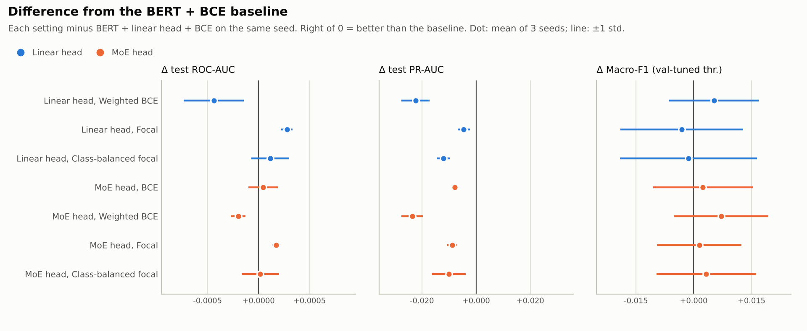
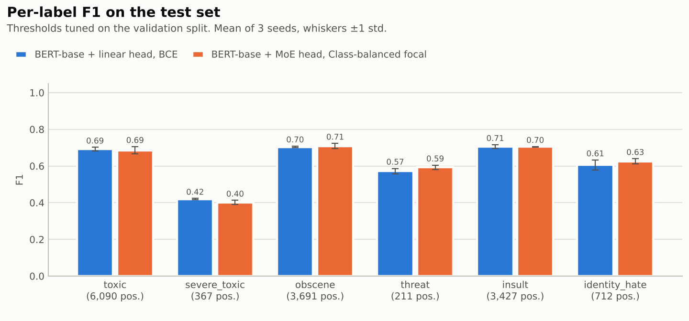
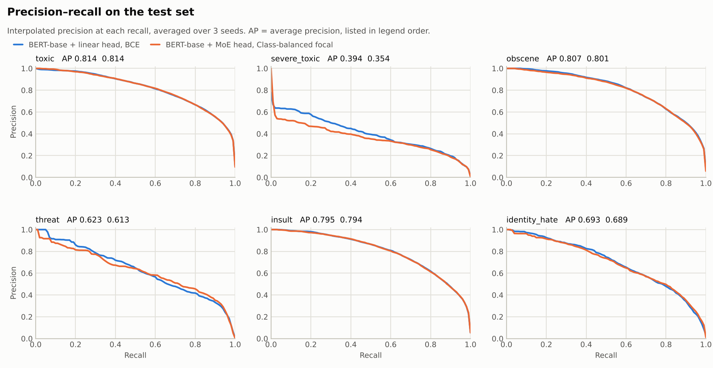
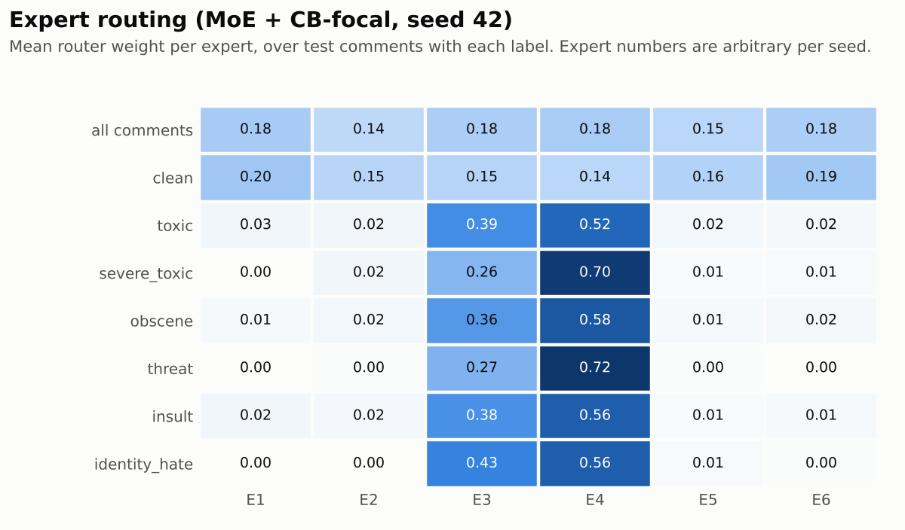

# Results

Trained on 143,613 comments (100% of `train.csv` minus a 15,958-comment validation split) and evaluated on the **63,978-comment official Kaggle test set**. F1 thresholds are tuned per label on the validation split, never on test. Every setting is trained with 3 seeds (42, 43, 44) on the same data split; cells show mean ± sample std over seeds. Best mean per column in bold; the paired table shows which differences are larger than seed-to-seed noise.

**Difference from the baseline (BERT + linear head + BCE), paired by seed.** Positive = better than the baseline. Mean ± std over 3 seeds.

| Head | Loss | Δ ROC-AUC | Δ PR-AUC | Δ Macro-F1 (val-tuned thr.) | Δ Rare-label F1 |
|---|---|---:|---:|---:|---:|
| Linear head | Weighted BCE | -0.0004 ± 0.0003 | -0.022 ± 0.005 | +0.005 ± 0.012 | +0.013 ± 0.022 |
| Linear head | Focal | +0.0003 ± 0.0001 | -0.005 ± 0.002 | -0.003 ± 0.016 | -0.003 ± 0.023 |
| Linear head | Class-balanced focal | +0.0001 ± 0.0002 | -0.012 ± 0.002 | -0.001 ± 0.018 | +0.001 ± 0.026 |
| MoE head | BCE | +0.0000 ± 0.0001 | -0.008 ± 0.001 | +0.002 ± 0.013 | +0.001 ± 0.014 |
| MoE head | Weighted BCE | -0.0002 ± 0.0001 | -0.024 ± 0.004 | +0.007 ± 0.012 | +0.017 ± 0.015 |
| MoE head | Focal | +0.0002 ± 0.0000 | -0.009 ± 0.002 | +0.001 ± 0.011 | +0.000 ± 0.013 |
| MoE head | Class-balanced focal | +0.0000 ± 0.0002 | -0.010 ± 0.006 | +0.003 ± 0.013 | +0.007 ± 0.012 |

**Routing.** Across all 12 MoE runs, comments carrying any toxic label put on average 90% (minimum 61%) of their router weight on the same two experts, whatever the kind of toxicity, while clean comments put 29% on those two experts (uniform routing would be 33%). The router learned a toxic-vs-clean split, not experts for specific kinds of toxicity.

**Loss × head ablation (BERT-base encoder)**

| Head | Loss | Test ROC-AUC | Test PR-AUC | Macro-F1 @0.5 | Macro-F1 (val-tuned thr.) | Rare-label F1¹ |
|---|---|---:|---:|---:|---:|---:|
| Linear head | BCE | 0.9855 ± 0.0001 | **0.688 ± 0.004** | 0.618 ± 0.001 | 0.617 ± 0.009 | 0.533 ± 0.012 |
| Linear head | Weighted BCE | 0.9850 ± 0.0003 | 0.665 ± 0.008 | 0.502 ± 0.003 | 0.622 ± 0.003 | 0.546 ± 0.010 |
| Linear head | Focal | **0.9858 ± 0.0001** | 0.683 ± 0.006 | 0.618 ± 0.002 | 0.613 ± 0.007 | 0.530 ± 0.012 |
| Linear head | Class-balanced focal | 0.9856 ± 0.0001 | 0.675 ± 0.006 | 0.543 ± 0.005 | 0.615 ± 0.010 | 0.534 ± 0.016 |
| MoE head | BCE | 0.9855 ± 0.0002 | 0.680 ± 0.003 | 0.619 ± 0.002 | 0.619 ± 0.005 | 0.534 ± 0.002 |
| MoE head | Weighted BCE | 0.9853 ± 0.0002 | 0.664 ± 0.005 | 0.507 ± 0.004 | **0.624 ± 0.004** | **0.550 ± 0.006** |
| MoE head | Focal | 0.9857 ± 0.0001 | 0.679 ± 0.004 | **0.619 ± 0.002** | 0.618 ± 0.005 | 0.533 ± 0.004 |
| MoE head | Class-balanced focal | 0.9855 ± 0.0001 | 0.677 ± 0.004 | 0.548 ± 0.001 | 0.620 ± 0.004 | 0.540 ± 0.007 |

¹ Mean test F1 over the three rarest labels: `severe_toxic`, `threat`, `identity_hate`.

**Per label (mean over seeds)**

| Label | Test positives | bert_bce PR-AUC | moe_cbfocal PR-AUC | bert_bce F1 | moe_cbfocal F1 |
|---|---:|---:|---:|---:|---:|
| `toxic` | 6,090 | 0.814 ± 0.001 | 0.814 ± 0.003 | 0.692 ± 0.011 | 0.686 ± 0.020 |
| `severe_toxic` | 367 | 0.394 ± 0.004 | 0.354 ± 0.020 | 0.420 ± 0.003 | 0.401 ± 0.012 |
| `obscene` | 3,691 | 0.807 ± 0.002 | 0.801 ± 0.002 | 0.704 ± 0.005 | 0.709 ± 0.015 |
| `threat` | 211 | 0.623 ± 0.023 | 0.613 ± 0.002 | 0.572 ± 0.015 | 0.593 ± 0.012 |
| `insult` | 3,427 | 0.795 ± 0.002 | 0.794 ± 0.001 | 0.705 ± 0.011 | 0.705 ± 0.001 |
| `identity_hate` | 712 | 0.693 ± 0.001 | 0.689 ± 0.012 | 0.606 ± 0.027 | 0.626 ± 0.014 |

<picture>
  <source media="(prefers-color-scheme: dark)" srcset="../docs/figures/ablation_dark.png">
  
</picture>

<picture>
  <source media="(prefers-color-scheme: dark)" srcset="../docs/figures/per_label_f1_dark.png">
  
</picture>

<picture>
  <source media="(prefers-color-scheme: dark)" srcset="../docs/figures/pr_curves_dark.png">
  
</picture>

<picture>
  <source media="(prefers-color-scheme: dark)" srcset="../docs/figures/expert_routing_dark.png">
  
</picture>

Run details

| Setting | Seeds | Best epoch per seed | Min / run | Precision | GPU |
|---|---|---|---:|---|---|
| `bert_bce` | 42, 43, 44 | 2, 2, 2 | 7.5 | bf16 | NVIDIA A100-SXM4-80GB |
| `bert_wbce` | 42, 43, 44 | 2, 2, 2 | 7.3 | bf16 | NVIDIA A100-SXM4-80GB |
| `bert_focal` | 42, 43, 44 | 2, 2, 2 | 7.4 | bf16 | NVIDIA A100-SXM4-80GB |
| `bert_cbfocal` | 42, 43, 44 | 2, 2, 2 | 7.4 | bf16 | NVIDIA A100-SXM4-80GB |
| `moe_bce` | 42, 43, 44 | 2, 2, 2 | 8.2 | bf16 | NVIDIA A100-SXM4-80GB |
| `moe_wbce` | 42, 43, 44 | 2, 2, 2 | 8.2 | bf16 | NVIDIA A100-SXM4-80GB |
| `moe_focal` | 42, 43, 44 | 2, 2, 2 | 8.2 | bf16 | NVIDIA A100-SXM4-80GB |
| `moe_cbfocal` | 42, 43, 44 | 2, 2, 2 | 8.2 | bf16 | NVIDIA A100-SXM4-80GB |

